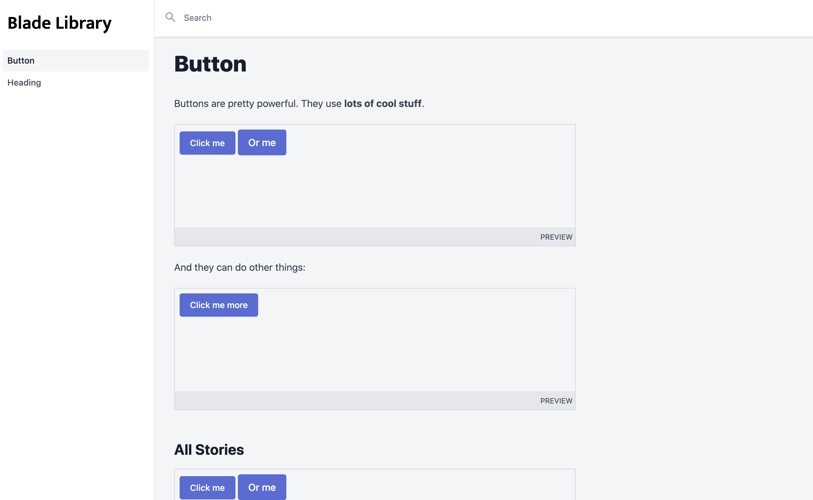

# Develop your Blade components in-browser.

[](https://packagist.org/packages/jplhomer/blade-library)
[](https://github.com/jplhomer/blade-library/actions?query=workflow%3Arun-tests+branch%3Amaster)
[](https://packagist.org/packages/jplhomer/blade-library)



## Installation

You can install the package via composer:

```bash
composer require jplhomer/blade-library
```

Then, publish assets, configuration, and views with:

```bash
php artisan blade-library:install
```

Next, you'll want to include your app's CSS stylesheet's in your component examples, or customize the logo used in Blade Library.

Edit the `head.blade.php` and `logo.blade.php` files published to your `resources/views/vendor/library/partials` directory.

```html
<!-- resources/views/vendor/library/partials/head.blade.php -->

<link rel="stylesheet" href="{{ mix('css/app.css') }}" />
```

## Usage

Use the `@story` Blade partial to define stories in your components:

```html
<!-- views/components/button.blade.php -->
<button>{{ $slot }}</button>

@story
<x-button>Example</x-button>
@endstory
```

Then, open up your app and view them at the `/library` route.

### Named stories

You can assign stories names by passing them to the `@story` directive:

```html
@story('My Story')
<x-button>Example</x-button>
@endstory
```

### Story Books

In addition to defining stories inline in your components, you can also create a dedicated `book` to provide documentation and additional story examples for your components.

First, create a file matching the name of your component within your `resources/views/books` directory:

```html
<!-- resources/views/books/button.blade.php -->

<p>Buttons are the foundation of our app:</p>

@story
<x-button>Click Me</x-button>
@endstory
```

When you provide a `book` of stories, it will be merged with any stories defined inline in your components.

## Testing

``` bash
composer test
```

## Changelog

Please see [CHANGELOG](CHANGELOG.md) for more information on what has changed recently.

## Contributing

Please see [CONTRIBUTING](CONTRIBUTING.md) for details.

## Security

If you discover any security related issues, please email jplhomer@gmail.com instead of using the issue tracker.

## Credits

- [Josh Larson](https://github.com/jplhomer)
- [All Contributors](../../contributors)

## License

The MIT License (MIT). Please see [License File](LICENSE.md) for more information.
